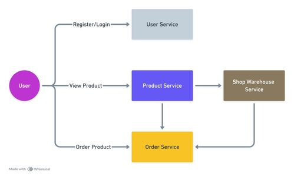

# Edot Test

### Architecture


### Tech Stack
- Echo v4
- Postgresql
- Jwt
- Machinery for worker

### Quick Installation Database
1. Run all database service
    ```sh
    $ docker compose up -d
    ```
2. Restore all file migration.sql in folder per-service databse

### Run Service
1. Run service user-service
    ```sh
    $ make start
    ```
2. Run service product-service
    ```sh
    $ make start
    ```
3. Run service shop-warehouse-service
    ```sh
    $ make start
    ```
4. Run service order-service

    terminal 1
    ```sh
    $ make start-server
    ```
    terminal 2
    ```sh
    $ make start-worker
    ```

### Test API On Insomnia 
1. Import file Insomnia_2025-05-18.json


### Contact
https://www.linkedin.com/in/aji-indra-jaya

License
----

MIT